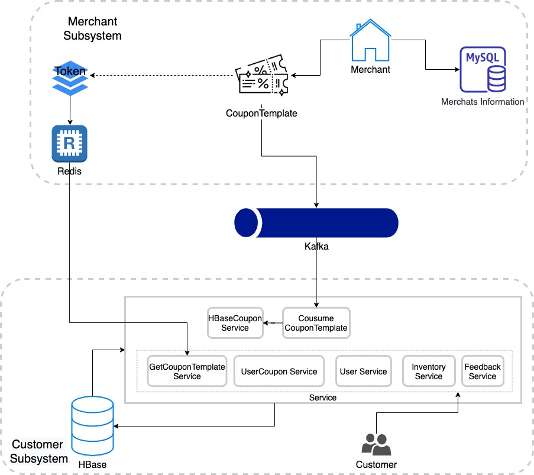

# Coupon Distribution System

## Introduction 
This is a Coupon Distribution Platform for both consumers and merchants. Customers can easily get and manage their coupons in this platform where Merchants can directly distribute them. Considering when some limited coupons come out a huge amount of customers would rush to get them, we would use Kafka to solve the problem of real-time data processing of a very large scale of messages. Also, we would use HBase to implement the storage of customers' information to ensure the read and write efficiency. After the implementation of our platform, we plan to use PostMan to test our APIs and JMeter to finish the stress testing.
## Development Tools
- Tools：Maven, JDK8, HBase, Kafka, MySQL
- Development Environment：Intellij IDEA
- Cache：Redis
- Framework：SpringBoot
## Application Structure

## [Technology Structure](https://github.com/jiaqi-xiao/Coupon-Distribution-System/blob/master/doc/Technology_Structure.md)

- Cache Design
- Utility
- Log
- Exception
- Table Structure

## Merchant Subsystem

### Function

- Create Merchant
- Distribute Coupon

### Package Structure

- constant -- constants definition
- security -- interceptor
- entity -- Merchant Entity Class
- dao -- Merchant Data Access Object Interface
- vo -- Value Object
- service -- Merchant service interface and implementation 

## Customer Subsystem

### Function

- User - Coupon Function
  - User get coupon
  - User use coupon
  - Get user's usable coupons
  - Get user's used coupons
  - Get user's all coupons
- Get Coupon Inventory
- Feedback Function

### Package Structure