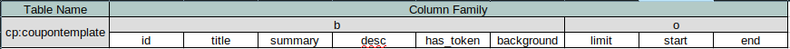
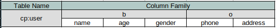
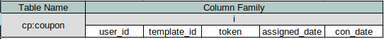
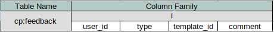

# Technology Structure

## Cache Design

- The token is cached in Redis
- The data structure of Set is used because the token does not need to maintain sequence information.
- When the merchant upload new token, it will be stored in init token file. When Token is used, used token file will be generated.
- Customers obtain tokens for coupons and distribute them directly from Redis to avoid direct file operations and reduce the delay caused by file I / O

## Utility

- Apache DigestUtils -- Encoding tool
- Apache RandomStringUtils  -- Random string generator
- Apache DateUtils -- Date tool
- Google Guava Enums -- Enumeration tools

## Log

- LogGenerator.java
- LogObject.java
  - action
  - userId
  - timestamp
  - remoteIp
  - info

## Exception

- @ControllerAdivce
  - Define a unified exception handler class
- @ExceptionHandler
  - Define the exception type for the function
  - Global capture and uniform handling of exceptions
- Restful APIcontact
  - Adding Response Body after @ExceptionHandler can convert that content to Json format and implement Restful API

## Table Structure

Merchant Information Table (MySQL)

| Arrtibute            | Meaning                     | Note                        |
| -------------------- | --------------------------- | --------------------------- |
| id                   | merchant id                 | primary key, AUTO_INCREMENT |
| name                 | merchant name               |                             |
| logo_url             | merchant logo               |                             |
| business_license_url | URL of merchant license     |                             |
| phone                | merchant phone number       |                             |
| address              | merchant address            |                             |
| is_audit             | if this merchant authorized | default: false              |

CouponTemplate Table (HBase)

|   Column   |          Meaning           |
| :--------: | :------------------------: |
|     id     |        merchant id         |
|   title    |        coupon title        |
|  summary   |       coupon summary       |
|    desc    |     coupon description     |
| has_token  | if this coupon need token  |
| background | background color of coupon |
|   limit    |    max number of coupon    |
|   start    |    validate start time     |
|    end     |     validate end time      |

User Table (HBase)

| Column  |        Meaning        |
| :-----: | :-------------------: |
|  name   |     customer name     |
|   age   |     customer age      |
| gender  |    customer gender    |
|  phone  | customer phone number |
| address |   customer address    |

- Rowkey <- (userID, curUserCount, randomNum5)

User - Coupon Table (HBase)

|    Column     |           Meaning            |                Note                 |
| :-----------: | :--------------------------: | :---------------------------------: |
|    user_id    |         customer id          |                                     |
|  template_id  |      coupon template id      |                                     |
|     token     |         coupon token         | token = -1 for no token requirement |
| assigned_date | when customer get the coupon |                                     |
|   con_date    | when customer use the coupon |     con_date = -1 for not used      |

Feedback Table (HBase)

|   Column    |      Meaning       |                 Note                 |
| :---------: | :----------------: | :----------------------------------: |
|   user_id   |    customer id     |                                      |
|    type     |    comment type    |              APP/COUPON              |
| template_id | coupon template id | if type = APP, then template_id = -1 |
|   comment   |  comment content   |                                      |